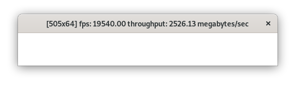

Utility for estimating `XPutImage` performance. Draws picture in window dimensions as fast as it can. 

## Use cases
This utility intended to help find proper graphical driver for legacy linux systems.

## How to build
`gcc x11-fps.c -lX11 -o x11-fps`

## Usage

Launch application: `./x11-fps`

Window title contains useful information, such as:

* frame dimensions
* frame draw rate (**fps**): Bigger is better.
* throughput measured in megabytes of picture data per second
